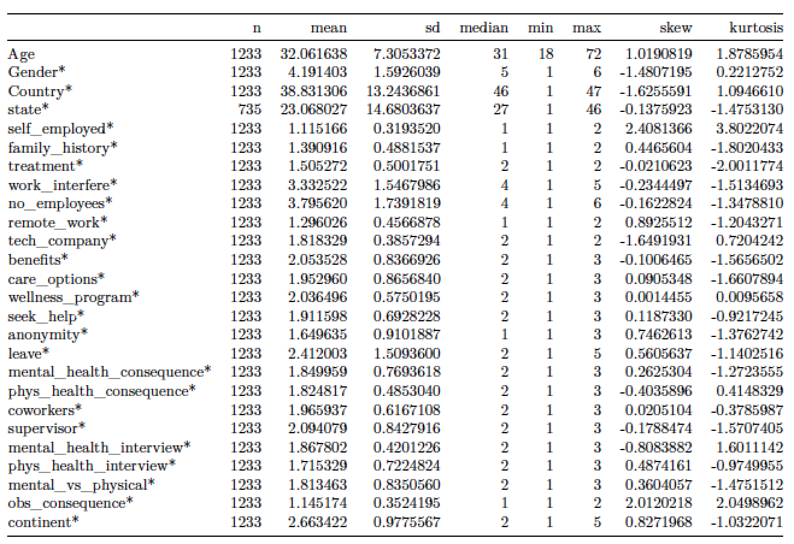

# Abstract

<<<<<<< HEAD
Mental illness is a disease that is gaining increasing awareness and acceptance as a legitimate health issue.  One organization, Open Sourcing Mental Illness, is focusing particularly on mental illness in the tech community.  In 2016, it completed a survey with 1400 respondents from the tech community that answered a wide variety of questions about their mental health, their employment benefits and offerings, and other demographic and related information.  Our team used the 2014 survey as our data set for this study.  After cleanup and transformation of variables, we built a model to predict whether an individual would seek professional mental health services using data submitted in the survey.  We built several models with differing sets of variables, but noted several important commonalities in predicting whether an individual would seek professional mental health help.  In particular, an individual was more likely to seek help if their employer offered mental health benefits, if the employee was well informed about the options offered by the employer for treatment, if anonymity could be maintained when using mental health or substance abuse treatment resources, and if the employee believed mental health to be negatively affecting work productivity.
=======
Mental illness is a complex set of interrelated conditions that are gaining increasing awareness and acceptance as a legitimate health issue of interest to employers.  One organization, Open Sourcing Mental Illness, is focusing particularly on mental illness in the information worker community in the technological sector, particularly in the open source community.  In 2016, it administered a survey to 1400 respondents from the tech community that addressed a wide variety of questions about mental health, employment benefits and offerings, personal and perceived workplace attitudes in regard to mental health, and other demographic and related information.  Our team used this data set for our project.  After cleanup and transformation of variables, we built a model to predict whether an individual would seek professional mental health services using data submitted in the survey.  We built several models with differing sets of variables, but noted several important commonalities among successful models that were influential in predicting the seeking of professional mental health help.  In particular, an individual was more likely to seek help if their employer offered mental health benefits, if the employee was well informed about the options offered by the employer for treatment, if anonymity could be maintained when using mental health or substance abuse treatment resources, and if the employee believed mental health to be negatively affecting work productivity.
>>>>>>> 048ec596b37ab8e3705e57114c82b2060a4d15b2

# Keywords

Mental illness, predictive modeling, workplace health, technology workers, health benefits

# Introduction

<<<<<<< HEAD
## Background on Open Sourcing Mental Illness

Open Sourcing Mental Illness is a non-profit organization that focuses on "raising awareness, educating, and providing resources to support mental wellness in the tech and open source communities" (https://osmihelp.org/about/about-osmi).  It began in 2013 when Ed Finkler, a life long sufferer of mental illnesses, began speaking at tech conferences about his experiences with mental illness.  Due to the positive response he received, he has continued to speak and research on mental illness in the tech community and to advocate for open discussion and support for those suffering from mental illness. 
=======
Open Sourcing Mental Illness (OSMI) is a non-profit organization that focuses on "raising awareness, educating, and providing resources to support mental wellness in the tech and open source communities" (Open Sourcing Mental Illness, 2018).It began in 2013 when Ed Finkler, a life long sufferer of mental illnesses, began speaking at technology conferences about his experiences with mental illness.  Due to the positive response he received, he has continued to speak and conduct research on mental illness in the technology community and to advocate for open discussion and support for those experiencing mental illness.  
>>>>>>> 048ec596b37ab8e3705e57114c82b2060a4d15b2

As part of Finkler's research,  several surveys have been conducted relating to mental health in the technology sector.  A 2014 survey had 1200 responses and focused generally on mental health in the tech industry, while a revised 2016 survey had 1400 responses and focused on "attitudes towards mental health in the tech workplace" (Open Sourcing Mental Illness, 2018).  At the time of this writing, a 2017 survey was still in progress.

<<<<<<< HEAD
## 2016 Survey

Given Finkler's desire to foster an open discussion about mental illness in the workplace, the raw survey data mentioned above is available.  Our team decided to use the 2016 survey data for conducting our analysis.  It can be downloaded from an associated Kaggle site (https://www.kaggle.com/osmi/mental-health-in-tech-2016).
=======
Given Finkler's desire to foster an open discussion about mental illness in the workplace, the raw survey data mentioned above is freely available for download.  Our team elected to use the most recent complete data, the 2016 survey data, for conducting our analysis.  It can be downloaded from an associated Kaggle site (https://www.kaggle.com/osmi/mental-health-in-tech-2016) or directly from the OSMI website.  

In addition to the data itself, OSMI has informational materials about workplace stressors, mental illness, and mental healh related costs.  Some of the data OSMI provides include the following information, which includes facts about their own data as well as about the scope of the impact of mental illness in the workplace. 
>>>>>>> 048ec596b37ab8e3705e57114c82b2060a4d15b2

  * About 1 in 5 people experience mental illness in population at large
  * 60% of 1400 respondents to survey had sought treatment for mental health conditions
  * 50% of 1400 respondents to survey had been diagnosed with a mental illness
  * "High-pressure companies" have health care expenses 50% greater than others
  * "60-80% of workplace accidents are attributed to stress"
  * "Over 80% of doctor visits are stress-related"
  * More days of work are lost due to mental illness than other chronic conditions like asthma, arthritis, back pain, diabetes, heart disease, and hypertension
  * Over 70% of costs associated with mental illness are found in indirect costs of absenteeism, presenteism (at work but not full productive), turnover, and training costs for replacing workers.
  
Why does this matter?  To quote, "employees work harder when they are happy, and happy employees leads to less turnover, which ensures that operations run more smoothly" (https://osmihelp.org/talks).  That is, there is a strong business case for addressing mental health in the workplace and providing support and medical care to those suffering from mental illness.  Such care and support creates a more productive and positive environment, and ultimately helps a company save on costs.

# Literature Review

Mental health issues are a global challenge for employers, with 20% of the workforce estimated to have moderate or severe mental illness (Memish 2017).  This is consistent with overall population prevalence estimates from regional health authorities and mental health organizations: NAMI suggests a prevalence rate in any given year of one in five, NIMH gives a rate just below that, at 18.3%, and the World Health Organization’s surveys of mental health (WMH) give similar statistics for data collected from 28 countries  (National Alliance on Mental Illness 2018, National Institute of Mental Health 2016, Kessler 2009).  The range and impact of mental health disorders vary widely, ranging in severity to mild to severely impairing the daily activities of living for an individual.  The World Health Organization classifies the severity of mental disorders into mild, moderate, and serious categories, while the US National Institutes of Health has a nested taxonomy, using the terms “any mental illness” (AMI) and “serious mental illness” (SMI).   According to this ontology, AMI is defined as any “mental, behavioral, or emotional disorder”  AMIs can include all levels of a disorder, from mild cases all the way to severe mental illness and impairment (National Institute of Mental Health 2017).  SMIs form a subset of AMIs and are described as "a mental, behavioral, or emotional disorder resulting in serious functional impairment.”  SMIs have major impacts on affected individuals, from interfering with daily living skills or activities to causing total or complete disability.  NIMH notes that “the burden of mental illnesses is particularly concentrated among those who experience disability due to SMI" (National Institute of Mental Health 2017).

With one-fifth of the working population affected by disorders such as depression and anxiety, it is unsurprising that the effects of mental health issues, whether transient or long-term, are costly not only to individuals, but to companies as well.  The International Labour Association estimated over a decade ago that the costs associated with mental health would continue to rise due to demographic changes and socioeconomic and violence-related stressors (International Labour Association, 2000).  While employee health is of critical importance to employers, few comprehensive guidelines exist to assist employers in setting up a robust system to deal with mental health issues and their consequences, with many employers relying only, or primarily, on an Employee Assistance Program (Page 2013, Memish 2017).  The ILA points out, however, that other workplace elements, including training, human resources policy, occupational health approaches, and managerial culture, are implicated in the success of workers with mental illness (International Labour Association, 2000).  In one of the rare randomized control trials on the subject, Millagan-Saville et al. demonstrated that supportive employer policies including positive managerial communication and practical support, have been demonstrated to have reduced worker absenteeism and be a worthwhile financial investment on the part of companies, which receive a modest return on investment (Milligan-Saville, 2017).  It is in employers’ best interests to maintain a healthy and satisfied staff.

Data from the 2016 SAMSHA survey includes the prevalence rates of mental illnesses among US adults. Not surprisingly, all races, genders, and age were affected by mental illness, with women affected at higher rates than men (NIMH 2018).  Particularly noteworthy is the fact that young and middle aged adults have the highest year prevalence rate of AMIs (over 21%), while older adults had markedly reduced rates of mental illness in a given year, at less than 15% (NIMH 2018).  This illustrates the importance of mental illness awareness in the workplace, as the principal workforce (by age) is the most profoundly affected by mental illness.

The serious impact of mental health disorders brings us to consider the topic of mental illness related mortality, specifically suicide and premature death caused by self-harm.  The majority of suicide deaths are attributable to depression, one of the most prevalent and fastest growing mental illnesses (International Labour Association, 2000).  Substance abuse is another costly and devastating consequence. Many individuals with mental health illnesses may attempt to cope with their struggles by using potentially hazardous and illicit pharmacological agents such as alcohol, narcotics, and benzodiazepines. Abuse of such agents can lead to long term medical health complications thus creating a vicious cycle of mental and physical health issues (Ma 2004).

Factors known to aggravate mental health include isolation, poor social support, burnout,	 and prolonged duration and high intensity levels of stress or trauma (Harvard Health Publishing 2017).  Perhaps unsurprisingly, high-stress career fields such as first responders and employees working rapidly changing, globalized sectors including those in the technology sector may tend to worsen mental health (Evans 2016, International Labour Association, 2000).   However, many individuals experiencing mental health struggles may feel pressured to not seek care or report their mental illnesses, as they may be afraid of being stigmatized, and as a result, mental illness in this workplace may likely be underreported, hidden, or kept secret, either at the time of experiencing symptoms or at a later date, such as returning to work after illness-related time off (International Labour Association, 2000).  

Despite a thorough search through Google Scholar and Pubmed, literature is sparse regarding mental health prevalence rates within the technology sector. One source, the Open Sourcing Mental Illness organization, has conducted surveys and attempted to collect and disseminate this information. By using this information, the authors have hoped to use preliminary information to analyze mental health influencers and produce more research in this ill-defined field. By performing rigorous data analysis and regression, we, as data scientists, hope to clarify any underlying patterns that exist in mental health illnesses within the technology industry.


# Methodology

## The Dataset

The data here is taken from https://www.kaggle.com/osmi/mental-health-in-tech-survey, which in turn was generated from the [Open Sourcing Mental Illness project](https://osmihelp.org/) (OSMI), which describes itself as "a non-profit, 501(c)(3) corporation dedicated to raising awareness, educating, and providing resources to support mental wellness in the tech and open source communities".  OSMI conducted survey-based research in 2014, 2016, and 2017, to collect data about professionals in the open source developer community and research their openness to accessing mental health resources.  The data we're using in this analysis comes from the 2014 survey results.  Let's take a quick peek at our data to diagnose any prima facie errors or issues.

## Data Summary

The data is 307.5 Kb in size. There are 1,259 rows and 27 columns (features). Of all 27 columns, 26 are discrete, 1 is continuous. There are 1,892 missing values out of 33,993 data points.

## Independant Variables

While only 13% populated, the comments field is fascinating and ripe for text analysis.   To make useful, the field would need to be further prepared using NLP and features would need to be prepared for any regression to be done.  The timestamp field has been converted to the appropriate object type. 

Our Age variable has some clear and impossible outliers.   There are multiple values < 18 (even some negative numbers) and some values > 200 years old.   Instead of replacing these, we set to NA and reviewed in the imputation process. We'll set the maximum reasonable age at 100, to accommodate any additional data that could potentially be added (e.g. from other years of the same survey).  Our minimum age will be 18, which allows us to know that we're conducting our analyses on adults (for human subjects protections reasons).  We'll remove the age from unrealistic measurements (like -1726 or 329, which are clearly impossible, and 5 or 11, which are too young to be able to be employed), and remove the entire row where the age is between 13 and 17, inclusive.  While there are currently no rows that seem to represent this underage teenager demographic, we add this out of an abundance of caution and to enable code reuse and reproducibility on similar datasets.

Gender is more interesting and complex in this dataset.   We trimmed down a very long list of self-reported gender by doing some rough matching and cleaning.  We see that there are some typos, some differences in capitalization, some differences in terminology ("woman" vs. "female"), some specifiers ("Cis" / "trans", some non-binary options, and some ambiguous answers.  We'll handle this by consolidating multiple terms into overarching categories and re-assigning common labels to each row.

## NA Handling

We have five variables with NAs - comments, state, work_interfere, self_employed, and age.   As noted earlier, without further feature creation, we'll exclude the comments variable entirely.  

Most of our missing values are for US States.   While it's fine for this to be missing if it's a non-US country, we conducted an additional study that showed that while that was mostly happening, there were also some additional issues that needed to be fixed.   This included having states associated with non-US countries (eg - Latvia, NY or Israel, MD).  In addition, since country and state were proving to be non-uniform, we leveraged the great country code R package to create a "continent" feature that can easily be included in the regression.

The work_interfere variable is a response to the question: "If you have a mental health condition, do you feel that it interferes with your work?"   I would suggest two possibile interpretations:

1)   "I do not have a mental health condition"
2)   "I don't want to respond about how my work is affected"

Since the treatment variable is pretty evenly split (No=622/Yes=637) on whether they've sought treatment for a mental health condition, it may not always be option 1.   Since we have no way of knowing which condition is likely, let's simply add a 5th category for "No Response"

For the remaining two fields (self_employed and age), since we will only lose 26 observations, let's simply remove those observations.  With this, our data is roughly ready for experimentation and modeling.   

```{r echo=FALSE, out.width='100%'}

```

# Experimentation and Model Building

## Model building

The goal of the model that we are building is to predict if an employee is going to seek mental health treatment, and this is going to depend on the circumstances at an employee work place.  

The type of model that we are going to build is a logit model.   This is because we are predicting a binary output.  Will the person seek mental health treatment or not.   

The method of model building that we are going to use is start with all the data, then drop variables that are not significant, build the model again and repeat.  

Right off the at we will drop the field state from the dataset, since over 50% of the values for state are not populated. We will also drop the Timestamp field as this is just the timestamp of when the user filled out the survey.  

## Model 1 

This model will predict mental if someone will seek mental health care based on all of the variables in the dataset with the exception of state.  

Here are the coeficents of this model: Coefficients: (4 not defined because of singularities)
                                Estimate Std. Error z value Pr(>|z|)    
(Intercept)                   -8.216e+01  3.595e+01  -2.285  0.02228 *  
Timestamp                      5.606e-08  2.548e-08   2.200  0.02779 *  
Age                            2.490e-02  1.324e-02   1.880  0.06014 .  
Genderfemale_trans            -7.312e-01  1.185e+00  -0.617  0.53710    
Genderfluid                   -1.635e+00  1.252e+00  -1.306  0.19148    
Gendergenderqueer              8.869e-01  1.221e+00   0.727  0.46751    
Gendermale_cis                -7.113e-01  2.480e-01  -2.868  0.00413 ** 
Genderunknown                  1.483e+01  3.956e+03   0.004  0.99701    
CountryAustria                -1.695e+01  1.679e+03  -0.010  0.99194    
CountryBelgium                -1.735e+00  1.624e+00  -1.068  0.28550    
CountryBosnia and Herzegovina -1.841e+01  3.956e+03  -0.005  0.99629    
CountryBrazil                  1.656e-01  1.431e+00   0.116  0.90791    
CountryBulgaria                3.516e+00  2.829e+00   1.243  0.21387    
CountryCanada                  1.155e-01  7.498e-01   0.154  0.87758    
CountryChina                  -1.706e+01  3.956e+03  -0.004  0.99656    
CountryColombia               -1.760e+01  2.781e+03  -0.006  0.99495    
CountryCosta Rica             -1.357e+01  3.956e+03  -0.003  0.99726    
CountryCroatia                 1.558e+01  2.705e+03   0.006  0.99540    
CountryCzech Republic         -2.031e+01  3.956e+03  -0.005  0.99590    
CountryDenmark                 1.645e+01  2.797e+03   0.006  0.99531    
CountryFinland                 1.534e-01  2.869e+00   0.053  0.95735    
CountryFrance                  7.050e-01  1.435e+00   0.491  0.62335    
CountryGeorgia                -1.738e+01  3.956e+03  -0.004  0.99649    
CountryGermany                 1.789e-01  7.962e-01   0.225  0.82218    
CountryGreece                 -1.277e+01  2.759e+03  -0.005  0.99631    
CountryHungary                -1.813e+01  3.956e+03  -0.005  0.99634    
CountryIndia                   1.125e+00  1.325e+00   0.849  0.39585    
CountryIreland                -8.187e-02  8.529e-01  -0.096  0.92354    
CountryIsrael                 -1.642e+01  1.469e+03  -0.011  0.99108    
CountryItaly                  -1.327e+00  1.366e+00  -0.972  0.33121    
CountryJapan                   1.606e+01  3.956e+03   0.004  0.99676    
CountryLatvia                 -1.240e+01  3.956e+03  -0.003  0.99750    
CountryMexico                  1.777e+00  2.461e+00   0.722  0.47034    
CountryMoldova                 1.379e+01  3.956e+03   0.003  0.99722    
CountryNetherlands            -4.686e-01  8.721e-01  -0.537  0.59104    
CountryNew Zealand             3.601e-02  1.130e+00   0.032  0.97458    
CountryNigeria                -1.279e+01  3.956e+03  -0.003  0.99742    
CountryNorway                 -1.456e+01  3.956e+03  -0.004  0.99706    
CountryPhilippines            -1.835e+01  3.956e+03  -0.005  0.99630    
CountryPoland                  5.475e-02  1.141e+00   0.048  0.96174    
CountryPortugal               -1.389e+01  2.627e+03  -0.005  0.99578    
CountryRomania                -1.182e+01  3.956e+03  -0.003  0.99762    
CountryRussia                 -1.602e+01  2.022e+03  -0.008  0.99368    
CountrySingapore              -1.338e+00  1.501e+00  -0.892  0.37245    
CountrySlovenia                1.843e+01  3.956e+03   0.005  0.99628    
CountrySouth Africa            1.690e+00  1.925e+00   0.878  0.37983    
CountrySpain                  -1.340e+01  3.956e+03  -0.003  0.99730    
CountrySweden                 -1.610e+00  1.311e+00  -1.228  0.21931    
CountrySwitzerland             1.180e+00  1.427e+00   0.827  0.40828    
CountryThailand               -1.456e+01  3.956e+03  -0.004  0.99706    
CountryUnited Kingdom          7.107e-01  6.862e-01   1.036  0.30030    
CountryUnited States           1.793e-01  6.642e-01   0.270  0.78720    
CountryUruguay                -1.227e+01  3.956e+03  -0.003  0.99753    
self_employedYes              -2.977e-01  3.543e-01  -0.840  0.40084    
family_historyYes              1.002e+00  1.919e-01   5.221 1.78e-07 ***
work_interfereNo Response     -2.534e+00  5.709e-01  -4.439 9.05e-06 ***
work_interfereOften            3.571e+00  3.743e-01   9.540  < 2e-16 ***
work_interfereRarely           2.539e+00  3.050e-01   8.325  < 2e-16 ***
work_interfereSometimes        2.960e+00  2.715e-01  10.904  < 2e-16 ***
no_employees100-500            2.208e-01  4.111e-01   0.537  0.59126    
no_employees26-100             2.780e-01  3.750e-01   0.741  0.45855    
no_employees500-1000           1.611e-01  5.637e-01   0.286  0.77505    
no_employees6-25               1.093e-01  3.514e-01   0.311  0.75582    
no_employeesMore than 1000    -1.209e-01  4.134e-01  -0.292  0.76992    
remote_workYes                -2.171e-01  2.168e-01  -1.001  0.31679    
tech_companyYes               -1.188e-01  2.538e-01  -0.468  0.63964    
benefitsNo                     2.747e-01  2.890e-01   0.951  0.34184    
benefitsYes                    8.175e-01  2.862e-01   2.857  0.00428 ** 
care_optionsNot sure          -1.570e-01  2.475e-01  -0.634  0.52592    
care_optionsYes                7.424e-01  2.562e-01   2.898  0.00375 ** 
wellness_programNo            -1.667e-01  3.197e-01  -0.522  0.60197    
wellness_programYes           -5.120e-01  3.772e-01  -1.357  0.17473    
seek_helpNo                   -6.722e-01  2.681e-01  -2.507  0.01216 *  
seek_helpYes                  -8.626e-01  3.310e-01  -2.606  0.00917 ** 
anonymityNo                   -1.645e-01  4.286e-01  -0.384  0.70107    
anonymityYes                   5.586e-01  2.472e-01   2.259  0.02387 *  
leaveSomewhat difficult        4.963e-01  3.313e-01   1.498  0.13420    
leaveSomewhat easy            -2.752e-01  2.440e-01  -1.128  0.25936    
leaveVery difficult            3.938e-01  3.743e-01   1.052  0.29278    
leaveVery easy                 1.501e-01  2.998e-01   0.501  0.61652    
mental_health_consequenceNo   -6.074e-02  2.595e-01  -0.234  0.81493    
mental_health_consequenceYes  -1.733e-01  2.666e-01  -0.650  0.51580    
phys_health_consequenceNo      8.976e-02  2.462e-01   0.365  0.71547    
phys_health_consequenceYes    -2.202e-03  4.845e-01  -0.005  0.99637    
coworkersSome of them          3.955e-01  2.589e-01   1.528  0.12658    
coworkersYes                   1.078e+00  3.795e-01   2.840  0.00451 ** 
supervisorSome of them        -4.168e-01  2.569e-01  -1.623  0.10467    
supervisorYes                 -3.558e-01  2.983e-01  -1.193  0.23295    
mental_health_interviewNo      3.469e-01  3.089e-01   1.123  0.26140    
mental_health_interviewYes     9.515e-01  6.762e-01   1.407  0.15943    
phys_health_interviewNo        1.385e-01  2.156e-01   0.642  0.52056    
phys_health_interviewYes       4.248e-01  3.029e-01   1.403  0.16071    
mental_vs_physicalNo          -1.025e-01  2.425e-01  -0.423  0.67258    
mental_vs_physicalYes         -2.825e-02  2.585e-01  -0.109  0.91298    
obs_consequenceYes             2.960e-01  2.843e-01   1.041  0.29768    
continentAmericas                     NA         NA      NA       NA    
continentAsia                         NA         NA      NA       NA    
continentEurope                       NA         NA      NA       NA    
continentOceania                      NA         NA      NA       NA    
---
Signif. codes:  0 '***' 0.001 '**' 0.01 '*' 0.05 '.' 0.1 ' ' 1


The AIC of the Model is 1115.3 and the area under the ROC curve is .9256

## Model 2

To build this model we are going to start with model1 and drop all of the variables that have a p-value of greater than .1.  The variables for this model are:  Age, Gender, work_interfere (amount of work interference of the mental health issue)  + family_history (If the person has a family history of mental health issues) , benefits (employer provides mental health benefits),  care_options (if the person know the care options) , anonymity (if the person can stay anonymous), coworkers ( If the person has coworkers they can talk to)  

The coefficients for this model are:  

                            Estimate Std. Error z value Pr(>|z|)    
(Intercept)               -6.452e-01  4.227e-01  -1.526 0.126963    
Age                        9.715e-03  9.906e-03   0.981 0.326717    
Genderfemale_trans         1.454e+01  5.739e+02   0.025 0.979793    
Genderfluid                2.844e-01  1.209e+00   0.235 0.814105    
Gendergenderqueer          5.714e-01  8.891e-01   0.643 0.520458    
Gendermale_cis             6.527e-02  1.816e-01   0.359 0.719289    
Genderunknown              1.474e+01  1.455e+03   0.010 0.991917    
work_interfereNo Response  1.164e-01  2.219e-01   0.524 0.600021    
work_interfereOften        7.010e-01  3.004e-01   2.334 0.019599 *  
work_interfereRarely       2.341e-01  2.615e-01   0.895 0.370669    
work_interfereSometimes    3.504e-01  2.127e-01   1.647 0.099500 .  
family_historyYes         -1.402e-01  1.604e-01  -0.874 0.382237    
benefitsNo                 2.260e+00  2.511e-01   9.000  < 2e-16 ***
benefitsYes                5.132e-01  1.874e-01   2.738 0.006183 ** 
care_optionsNot sure      -6.478e-01  1.695e-01  -3.823 0.000132 ***
care_optionsYes            2.465e-01  2.219e-01   1.111 0.266631    
anonymityNo                1.669e+00  6.234e-01   2.678 0.007411 ** 
anonymityYes               8.418e-01  1.877e-01   4.486 7.26e-06 ***
coworkersSome of them      2.160e-01  1.823e-01   1.185 0.235920    
coworkersYes               3.495e-01  2.412e-01   1.449 0.147304  


The AIC is 1225 and the area under the curve is .7959

## Model 3

For model 3, I am going to take the variables with a pvalue of .1 or higher from model1 and use them to predict if an employee will seek treatment.  They are the amount of interference from work that the issue causes, employer provides mental health benefits, know the care options, and stay anonymous.  

The coefecients of this model are: 
                          Estimate Std. Error z value Pr(>|z|)    
(Intercept)                -0.1029     0.1968  -0.523 0.601285    
work_interfereNo Response   0.1120     0.2210   0.507 0.612212    
work_interfereOften         0.6785     0.2917   2.326 0.020016 *  
work_interfereRarely        0.1974     0.2565   0.770 0.441492    
work_interfereSometimes     0.2932     0.2026   1.447 0.147773    
benefitsNo                  2.2535     0.2493   9.039  < 2e-16 ***
benefitsYes                 0.4985     0.1843   2.704 0.006846 ** 
care_optionsNot sure       -0.6467     0.1680  -3.849 0.000119 ***
care_optionsYes             0.2738     0.2199   1.245 0.213138    
anonymityNo                 1.6010     0.6244   2.564 0.010345 *  
anonymityYes                0.8375     0.1861   4.499 6.83e-06 ***
---
Signif. codes:  0 '***' 0.001 '**' 0.01 '*' 0.05 '.' 0.1 ' ' 1


The AIC is   1214.9 and the Area under the curve is  .7912

## Summary of Results
There is not much difference between model 2 and model 3.  Model 1 the model with all the variables is the best model as it has the lowest AIC and the highest area under the curve.  Therefore, this is a very well-designed survey for predicting if a person is going to seek mental health care.  Also if you are an employer and you want to encourage you employees to seek mental health care the things you can do are the following
1)	Provide Benefits
2)	Make sure the person knows the care options
3)	Make sure the person can stay anonymous
Also the most personally influential factor if someone is going to seek help is if the mental illness interferes with work.  

The biggest surprise in the data, is that if the employer provides resource or a wellness program they do not predict very well if the person is going to seek treatment.  This is probably because people want to stay anonymous if the seek mental health treatment.  

# Final Discussion and Conclusions

# Figures

See word document


# Code
```{r, eval=FALSE, echo=TRUE}
if (!require('countrycode')) (install.packages('countrycode'))
if (!require('dplyr')) (install.packages('dplyr'))
if (!require('psych')) (install.packages('psych'))
if (!require('DataExplorer')) (install.packages('DataExplorer'))
if (!require('lubridate')) (install.packages('lubridate'))
url <- paste("https://raw.githubusercontent.com/",
"RaphaelNash/CUNY_DATA621_GroupProject/master/Data/survey_RAW.csv",
sep="")
df <-read.csv(url)
knitr::kable(head(df[,1:7]))
knitr::kable(head(df[,8:14]))
knitr::kable(head(df[,15:19]))
knitr::kable(head(df[,20:24]))
knitr::kable(head(df[,25:27]))

#comments
sample <- df[!(is.na(df$comments)), ]
head(sample$comments)
#timestamp
df$Timestamp <- ymd_hms(df$Timestamp)

##age
df <- df %>% filter(Age >= 18 | Age < 13 )
df$Age[df$Age > 100 | df$Age < 18 ] <- NA

##gender
df$Gender <- tolower(df$Gender)
df$Gender <- trimws(df$Gender)

### start with the obvious
cis_female_syn <- c("femail", "f", "woman", "femail", "female (cis)",
                    "cis female", "cis-female/femme", "femake", 
                    "female")
df$Gender[df$Gender %in% cis_female_syn] <- "female_cis"

cis_male_syn <- c("m", "man", "male (cis)", "male", "mal", "mail", 
                  "maile", "cis man", "cis male", "msle", "malr", 
                  "make")
df$Gender[df$Gender %in% cis_male_syn] <- "male_cis"

trans_female_syn <- c("trans woman", "trans-female", "female (trans)")
df$Gender[df$Gender %in% trans_female_syn] <- "female_trans"

genderqueer_syn <- c("non-binary", "enby", "queer", "queer/she/they",
                     "fluid", "androgyne", "agender", "neuter")
df$Gender[df$Gender %in% genderqueer_syn] <- "genderqueer"

fluid_syn <- c("male leaning androgynous", "male-ish", 
                   "ostensibly male, unsure what that really means", 
                   "something kinda male?", "guy (-ish) ^_^")
df$Gender[df$Gender %in% fluid_syn] <- "fluid"

unknown <- c("a little about you", "all", "p", "nah")
df$Gender[df$Gender %in% unknown] <- "unknown"

### Let's update some call out issues.   Obvs 967 reported "female" 
# in the Gender field, but noted being a trans woman in the comments.  
df$Gender[967] <- "female_trans"

df$Gender <- as.factor(df$Gender)
table(df$Gender)

#state
#Number of observations that aren't United States
nrow(df[df$Country != "United States",])

#Number of missing states
sum(is.na(df$state))

nrow(df[df$Country == "United States" & is.na(df$state),])

# there are 11 missing states.  
df$state <- as.character(df$state)
df$state[df$Country == "United States" & is.na(df$state)] <- "Unknown"

# Still some missing:   non-US countries w/ states?!
sub <- df[df$Country != "United States" & !is.na(df$state),]

knitr::kable(sub[, c("state", "Country")])

# Ok, that's weird.   Let's NA those
df$state[df$Country != "United States" & !is.na(df$state)] <- NA

df$state <- as.factor(df$state)
rm(sub)
df$continent <- as.factor(countrycode(sourcevar = df[, "Country"],
                                      origin = "country.name",
                                      destination = "continent"))
table(df$continent)

df$work_interfere <- as.character(df$work_interfere)
df$work_interfere[is.na(df$work_interfere)] <- "No Response"
df$work_interfere <- as.factor(df$work_interfere)

summary(df[, c("work_interfere", "self_employed", "Age")])

df <- df[!is.na(df$self_employed),]
df <- df[!is.na(df$Age),]

## Data Summary


summary <- describe(df[,c(2:26, 28)])[,c(2:5,8,9,11,12)]
knitr::kable(summary)

clean <- df
clean$Timestamp <- NULL
clean$comments <- NULL
clean$state <- NULL

out <- split_columns(clean)

plot_histogram(out$continuous)
plot_bar(out$discrete)


### Relationship of Predictors to Target:  "treatment"


plot_scatterplot(clean, "treatment", position = "jitter")

saveRDS(df, "../Data/MentalHealthCLEAN.rds")

Experimentation and Results
df = df[,!(names(df) %in% c("state", "comments", "Timestamp"))]
model1 <- glm(treatment ~. , data =df, family=binomial )
summary(model1)
model2 <- glm(seek_help~ Age+Gender+ family_history+ work_interfere+family_history+benefits+care_options+anonymity+coworkers,  data =df, family=binomial )
summary(model2)
model3 <- glm(seek_help~ work_interfere + benefits+ care_options+  anonymity , data =df, family=binomial )
summary(model3)
library(Deducer)
rocplot(model1)
rocplot(model2)
rocplot(model3)


```

# References

  * Mental Illness. National Institute of Mental Health, U.S. Department of Health and Human Services, Nov. 2017, www.nimh.nih.gov/health/statistics/mental-illness.shtml.
  * Psychosocial Disorders.Emergency Medicine Manual, Sixth Edition, by O. John. Ma and David Cline, McGraw-Hill, Medical Pub. Division, 2004, pp. 1807 - 1816.
  * Harvard Health Publishing. What Causes Depression? - Harvard Health.? Harvard Health Blog, 17 Apr. 2017, www.health.harvard.edu/mind-and-mood/what-causes-depression.
  * Evans, Judith, et al. Mental Illness Flourishes in High-Pressure Workplace. Financial Times, Financial Times, 14 Sept. 2016, www.ft.com/content/d4168a70-4533-11e6-9b66-0712b3873ae1.
  * OSMI Home Open Sourcing Mental Illness - Changing How We Talk about Mental Health in the Tech Community - Stronger Than Fear, osmihelp.org/.
  * https://osmihelp.org/about/about-osmi
  * https://osmihelp.org/research
  * https://www.kaggle.com/osmi/mental-health-in-tech-2016
  * https://osmihelp.org/talks


